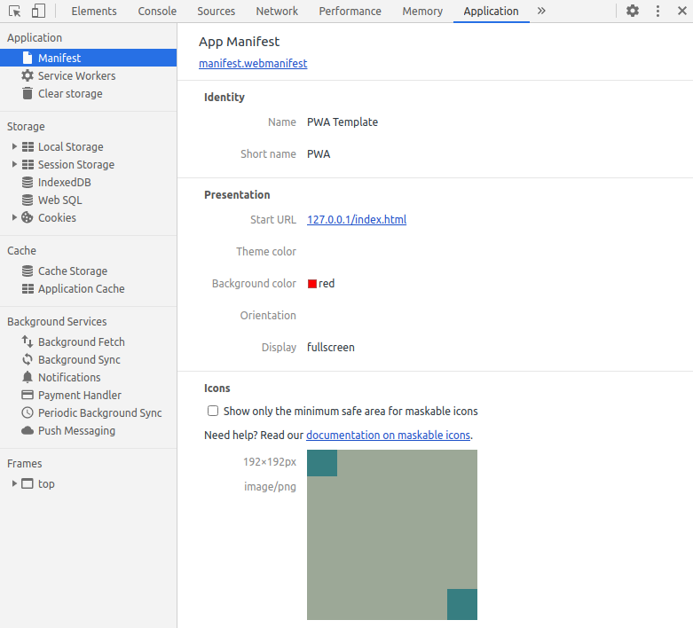

# Progressive Web Application

PWA must have the following features (minimum).

1. Secure contexts (HTTPS).
2. Service worker.
3. A manifest file.

## Secure Contexts

*"A simple tool for making locally-trusted development certificates."*

https://github.com/FiloSottile/mkcert

```console
sudo apt install libnss3-tools
```

Build **mkcert** from source (Go) or use the pre-built binaries.

```console
mkcert -install
mkcert localhost 127.0.0.1
```

Use **servehttps.go**. Specify the right files for a key and a certificate,  if those files has changed.

## Service Worker


## Manifest

*"The web app manifest provides information about a web application in a JSON text file, necessary for the web app to be downloaded and be presented to the user similarly to a native app (e.g., be installed on the homescreen of a device, providing users with quicker access and a richer experience). PWA manifests include its name, author, icon(s), version, description, and list of all the necessary resources (among other things)."*

https://developer.mozilla.org/en-US/docs/Web/Manifest


